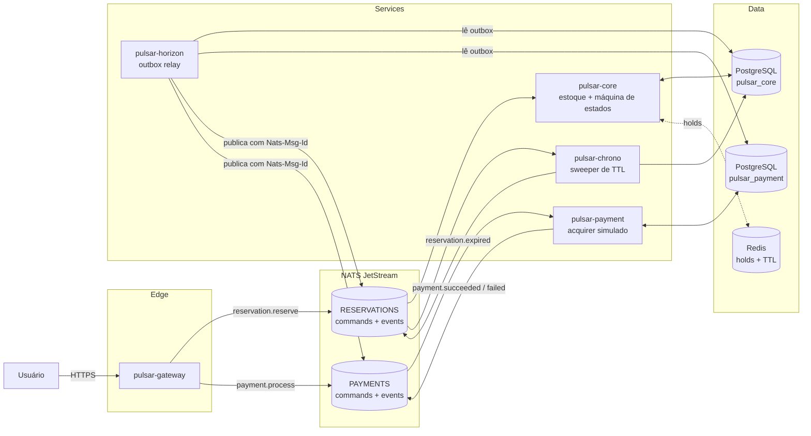

# PulsarPass

Sistema de reserva de ingressos para eventos de alta demanda (*flash sales*): milhares de usuários disputando estoque limitado no mesmo segundo, com retenção temporária de assento (TTL), pagamento assíncrono e **zero overbooking**.

> Blueprint completo: [`docs/ARCHITECTURE.md`](docs/ARCHITECTURE.md) · Diagramas: [`docs/diagrams/`](docs/diagrams/) · Diário de ciclos: [`docs/CYCLES.md`](docs/CYCLES.md)

## Como funciona

A saga inteira é dirigida por comandos e eventos no NATS JetStream; cada serviço é a autoridade do seu próprio estado (Postgres) e publica resultados via **outbox transacional** relayado pelo `pulsar-horizon` (com dedup `Nats-Msg-Id` no broker). A garantia central — **zero overbooking** — vive num único `UPDATE` condicional do estoque, atômico no Postgres.



Caminho feliz resumido (versão detalhada com SQL e ramificações em [`docs/diagrams/success-flow.mmd`](docs/diagrams/success-flow.mmd); compensações em [`timeout-compensation.mmd`](docs/diagrams/timeout-compensation.mmd)):

1. `POST /v1/reservations` → o gateway publica o comando `reservation.reserve`.
2. `pulsar-core` debita capacidade com `UPDATE ... WHERE reserved_count + sold_count < capacity` e grava a reserva `PENDING` com `expires_at` (TTL) — tudo num commit.
3. O usuário paga: `POST /v1/reservations/{id}/payment` → `payment.process` → `pulsar-payment` chama o acquirer (simulado) e publica `payment.succeeded`/`payment.failed` via outbox.
4. `pulsar-core` consome o outcome e confirma a reserva (`CONFIRMED`, ticket `SOLD`) ou marca a falha (`FAILED`), liberando o assento.
5. Quem não paga a tempo é varrido pelo `pulsar-chrono` (`reservation.expired` → `EXPIRED`, assento devolvido). Sem overbooking, sem assento fantasma.

Máquina de estados completa: [`docs/diagrams/reservation-state-machine.mmd`](docs/diagrams/reservation-state-machine.mmd).

## Stack

Go 1.24+ (somente stdlib nos serviços) · NATS JetStream · PostgreSQL · Redis · Docker Compose · k6 (carga) · kind + Helm (deploy) · OpenTelemetry (traces OTLP + métricas Prometheus)

## Serviços

| Serviço | Papel | API | Health/Metrics |
|---|---|---|---|
| `pulsar-gateway` | Ingress HTTP: validação, idempotência e publicação de comandos | `:8080` | `:9091` |
| `pulsar-core` | Estoque + máquina de estados da reserva (autoridade no Postgres) | — | `:9092` |
| `pulsar-chrono` | TTL worker: sweep de reservas expiradas → compensação | — | `:9093` |
| `pulsar-payment` | Processador de pagamento (acquirer simulado) | — | `:9094` |
| `pulsar-horizon` | Outbox relay: garantia de entrega dos eventos ao broker | — | `:9095` |

Health/readiness: `GET /healthz` e `/readyz` nas portas `:9091–:9095` (o `/readyz` só abre quando o consumidor está de pé). Métricas Prometheus em `/metrics` nas mesmas portas. O header `X-Version` expõe a versão embutida no binário.

## Layout

```
cmd/<serviço>/        # binários (wires: config → adapters → use cases → bus)
internal/<serviço>/   # código privado (domain → application → adapters)
pkg/                  # libs compartilhadas (envelope, eventbus, health, metrics, holds...)
migrations/           # SQL versionado por serviço (core/, payment/)
deployments/          # compose, Dockerfile, kind, Helm, k6, grafana/prometheus provisionados
docs/                 # blueprint de arquitetura, diário de ciclos e diagramas
```

## Pré-requisitos

- **Go 1.24+** — build e testes.
- **Docker + Docker Compose** — infra local e suíte e2e (testcontainers).
- **[golang-migrate](https://github.com/golang-migrate/migrate)** — aplica as migrations (alternativa manual no quickstart abaixo).
- **k6** — só para a prova de carga (roda em container pelo Makefile).
- **kind + kubectl + helm** — só para o deploy em cluster.

## Quickstart

```bash
# 1. Infra local (Postgres :5432, Redis :6379, NATS :4222, Jaeger, Prometheus, Grafana)
make compose-up

# 2. Migrations (bases pulsar_core e pulsar_payment)
make migrate-core-up
make migrate-payment-up

# 3. Semear um evento de demonstração (venda aberta, começa em 24h)
#    Imprime o EVENT_ID — guarde-o.
make load-seed CAPACITY=100

# 4. Subir os cinco serviços (cada um em um terminal, ou com &)
make build
make run-horizon &   # relay do outbox → JetStream
make run-core &      # estoque + máquina de estados
make run-payment &   # acquirer simulado
make run-chrono &    # sweeper de TTL
make run-gateway &   # API :8080

# 5. Fluxo completo: reservar → pagar
EVENT_ID=<id do passo 3>
RES=$(curl -s -X POST localhost:8080/v1/reservations \
  -H "Content-Type: application/json" \
  -H "Idempotency-Key: demo-001" \
  -H "X-User-Id: user-1" \
  -d "{\"event_id\":\"$EVENT_ID\",\"quantity\":2}")
echo "$RES"    # {"status":"accepted","reservation_id":"..."}

RID=$(echo "$RES" | sed -E 's/.*"reservation_id":"([^"]+)".*/\1/')
curl -s -X POST localhost:8080/v1/reservations/$RID/payment \
  -H "Content-Type: application/json" \
  -H "Idempotency-Key: pay-001" \
  -H "X-User-Id: user-1" \
  -d '{"payment_method_token":"tok-1"}'

# 6. O pagamento é assíncrono: acompanhe o resultado no estado da reserva (psql)...
docker compose -f deployments/docker-compose.yml exec postgres \
  psql -U pulsar -d pulsar_core -c \
  "select id, status, amount_cents, currency from reservations where id = '$RID'"
# status: PENDING → CONFIRMED (pago) / EXPIRED (TTL vencido) / FAILED (recusa) — ou veja a saga
# inteira como um único trace no Jaeger e os outcomes no dashboard do Grafana.
```

> O mesmo fluxo, ponta a ponta e automatizado, é o que o CI executa a cada PR (`make cluster-smoke` e a suíte e2e).

## API do gateway

| Método | Rota | Descrição |
|---|---|---|
| `POST` | `/v1/reservations` | Cria uma reserva (comando assíncrono; `202 Accepted`) |
| `POST` | `/v1/reservations/{id}/payment` | Submete o pagamento (comando assíncrono; `202 Accepted`) |
| `GET` | `/v1/reservations/{id}` | Consulta — **ainda não implementada** (`501`; query flow no roadmap) |

Cabeçalhos obrigatórios nas mutações:

- **`Idempotency-Key`** — chave de idempotência do comando; repetir a chave não duplica efeito (dedup no broker + replay guard no core/payment).
- **`X-User-Id`** — identidade do chamador (laboratório: header client-supplied; a posse da reserva é verificada no payment — identidade verificada é o próximo ciclo).

Corpo da criação: `{"event_id": "<uuid>", "quantity": 1..MAX_RESERVATION_QTY}`. Corpo do pagamento: `{"payment_method_token": "tok-..."}` — preço e moeda vêm **sempre** da projeção da reserva, nunca do cliente.

Como os comandos são assíncronos, a decisão de estoque (assento garantido vs `sold_out`) e o resultado do pagamento não chegam na resposta HTTP — o gateway responde `202` na publicação do comando. Rejeições síncronas: `400` payload/cabeçalho inválido e `503` bus indisponível. O resultado aparece no estado projetado da reserva, no dashboard do Grafana (`pulsar_core_reservations_total{outcome}`, `pulsar_payment_charges_total{outcome}`) e como um único trace da saga no Jaeger.

## Configuração (variáveis de ambiente)

Tudo tem padrão coerente para o quickstart; a tabela lista as variáveis por serviço.

| Variável | Serviço | Padrão | Descrição |
|---|---|---|---|
| `APP_ENV` | todos | `development` | `development` (log text) / `production` (log JSON) |
| `HEALTH_ADDR` | todos | `:9091`–`:9095` | Porta de liveness/readiness/metrics |
| `HTTP_ADDR` | gateway | `:8080` | Porta da API |
| `NATS_URL` | todos | `nats://localhost:4222` | Broker JetStream |
| `BUS_MODE` | gateway | `nats` | `memory` força o bus in-memory (demo sem broker) |
| `DATABASE_URL` | core, chrono, payment | DB `pulsar_core` / `pulsar_payment` | Postgres do serviço |
| `CORE_DATABASE_URL` / `PAYMENT_DATABASE_URL` | horizon | DBs `pulsar_core` / `pulsar_payment` | Outboxes lidas pelo relay |
| `REDIS_ADDR` | core, chrono | `localhost:6379` | Acelerador de hold (`hold:{reservation_id}`); degradação graciosa com breaker |
| `RESERVATION_TTL` | core | `10m` | Janela de retenção da reserva |
| `SWEEP_INTERVAL` / `SWEEP_BATCH` | chrono | `5s` / `100` | Sweeper de expiração |
| `POLL_INTERVAL` / `RELAY_BATCH` | horizon | `1s` / `200` | Relay do outbox |
| `MAX_RESERVATION_QTY` | gateway | `8` | Limite anti-hoarder por reserva |
| `SIMULATED_CHARGE_DELAY` | payment | `250ms` | Latência artificial do acquirer |
| `SIMULATED_FAILURE_RATE` | payment | `0.05` | Taxa de recusa simulada |
| `OTEL_EXPORTER_OTLP_ENDPOINT` | todos | unset | Ex.: `http://localhost:4317`; unset = sem traces (métricas seguem) |
| `OTEL_TRACE_SAMPLE_RATIO` | todos | `1` | Amostragem de spans raiz em [0,1]; valor inválido falha o boot |

## Observabilidade

Com `make compose-up` + os serviços no ar (`make run-*`):

- **Grafana** (`http://localhost:3000`, login anônimo) — dashboard **"PulsarPass — Saga overview"** provisionado com os sinais do blueprint: requests/s e p99 do gateway, reservas e esgotamento (`sold_out`) por segundo, charges por outcome, **esperas inline do payment por outcome** (`resolved`/`exhausted`/`aborted`), backlog das outboxes, idade da reserva `PENDING` mais antiga, operações e circuit breaker do acelerador Redis, advisories de DLQ.
  - **Alerta provisionado** (`payment-context-waits-exhausted`): dispara quando o wait inline pela projeção `reservation_context` esgota o budget de forma sustentada — o sinal de `reservation_id` fantasma (ou lag anômalo da projeção). Regra em `deployments/docker/grafana/provisioning/alerting/`.
- **Prometheus** (`http://localhost:9090`) — coleta os 5 serviços via `/metrics` (host.docker.internal).
- **Jaeger** (`http://localhost:16686`) — tracing distribuído OTLP. Exporte `OTEL_EXPORTER_OTLP_ENDPOINT=http://localhost:4317` antes de subir os serviços; a saga aparece como um trace único (gateway → core → payment → core). Sob carga, limite o volume com `OTEL_TRACE_SAMPLE_RATIO=0.1`.

Principais métricas (todas com prefixo `pulsar_*`; descrições completas no dashboard):

| Métrica | Serviço | Sinal |
|---|---|---|
| `pulsar_gateway_http_requests_total` / `..._request_duration_seconds` | gateway | tráfego e p99 do ingress |
| `pulsar_core_reservations_total{op,outcome}` | core | reservas criadas; `sold_out` (esgotamento); `sale_not_open` (T-0) |
| `pulsar_payment_charges_total{outcome}` | payment | aprovações, recusas, erros de acquirer |
| `pulsar_payment_context_waits_total{outcome}` | payment | corrida com a projeção (`resolved`) vs ID fantasma (`exhausted`) |
| `pulsar_horizon_outbox_backlog` | horizon | dívida do relay — precisa drenar a zero |
| `pulsar_chrono_pending_max_age_seconds` | chrono | reserva `PENDING` mais antiga vs TTL |
| `pulsar_holds_*` | core/chrono | acelerador Redis: latência, breaker |
| `pulsar_eventbus_dlq_advisories_total` | eventbus | mensagens que esgotaram `MaxDeliver` (DLQ) |

## Testes e qualidade

```bash
make fmt vet lint test   # qualidade completa (-race por padrão, paridade com o CI)
SKIP_E2E=1 make test     # iteração rápida sem Docker (pula a suíte testcontainers)
make test-cover          # cobertura, igual ao job de test do CI
make docker-build        # imagens dos 5 serviços
make compose-down        # derruba a infra
```

- **Unidade** — use cases e packages com fakes de porta (`internal/*`, `pkg/*`); `-race` ligado por padrão.
- **Integração** — adaptadores Postgres e a saga e2e com testcontainers (`internal/e2e`), que exercita sucesso, compensações, posse e idempotência exatamente com os subscribers de produção.
- **Smoke de cluster** — `make cluster-smoke` roda a saga no kind (no CI a cada PR).
- Re-executar testes de pacote com métricas é seguro: o rebind de instrumentos no shutdown suporta `-count>=2`.

## Prova de carga

Perfil de referência: 300 VUs de pico, ramp 2min + platô 3min + ramp-down 1min, p99 do ingress < 250ms, **zero overbooking**. Os knobs são env no script (`deployments/k6/flash-sale.js`).

```bash
make compose-up && make migrate-core-up && make migrate-payment-up
make build

# recomendado sob carga: acquirer rápido e relay folgado
SIMULATED_CHARGE_DELAY=1ms make run-payment &
RELAY_BATCH=500 POLL_INTERVAL=200ms make run-horizon &
make run-core & make run-chrono & make run-gateway &

EVENT_ID=$(make load-seed CAPACITY=1000)           # semeia o evento e imprime o id
make load-run EVENT_ID=$EVENT_ID                   # suíte k6 (thresholds: p99, 0% falhas)
make load-verify                                   # invariantes de inventário: imprime 0 se sãos
```

O `load-run` executa o k6 em container com `--network host` (semântica Linux; em macOS/Windows ajuste para `host.docker.internal` no Makefile). Enquanto roda, acompanhe o dashboard no Grafana: `sold_out` dispara no pico, o backlog das outboxes precisa drenar a zero no ramp-down e o breaker não pode abrir sem Redis fora.

## Deploy (kind + Helm)

O cluster de deploy reproduz a topologia do compose com réplicas e primitivas de Kubernetes (probes, hooks de migration, NodePort). Requer `kind`, `kubectl` e `helm` instalados.

```bash
make cluster-up                                             # kind com port mappings (gateway :8080, UIs :3000/:9090/:16686)
make deploy-infra                                           # Postgres/Redis/NATS/Jaeger + Prometheus/Grafana (charts pinados)
make deploy-services                                        # chart pulsar-pass (imagens GHCR do release, 2 réplicas por serviço)
make cluster-smoke                                          # saga e2e no cluster: reserva, pagamento, holds, métricas, traces
make cluster-down                                           # derruba tudo
```

O `deploy-services` aceita overrides para smoke local com imagens dev:

```bash
make docker-build && kind load docker-image pulsarpass/pulsar-gateway:dev --name pulsarpass   # (repita por serviço)
make deploy-services IMAGE_TAG=dev IMAGE_REGISTRY=pulsarpass EXTRA_SETS='--set services.payment.simulatedFailureRate=0'
```

## CI & Releases

| Workflow | Gatilho | O que faz |
|---|---|---|
| `CI` | push em `main` e PRs | lint (golangci-lint), testes com race detector + coverage, build dos 5 binários, smoke de imagem Docker (matrix por serviço), **deploy smoke (kind: infra + serviços + saga e2e)** e checagem do título do PR (Conventional Commits) |
| `Release` | tag `v*.*.*` | quality gate → GitHub Release com binários multi-arch + checksums (GoReleaser) → imagens Docker `linux/amd64` + `linux/arm64` publicadas no GHCR |

Cortar uma release:

```bash
git tag -a v0.1.0 -m "release v0.1.0"
git push origin v0.1.0        # dispara o workflow de Release
```

Imagens publicadas: `ghcr.io/adamsalves/pulsar-pass/<serviço>:{version,sha,latest}`. Metadados de build ficam embutidos nos binários (`pkg/version`) e expostos via header `X-Version` em `/healthz` e `/readyz`.

Validação local do release (sem publicar):

```bash
make release-check     # valida .goreleaser.yaml
make release-snapshot  # compila tudo em dist/ (snapshot 0.0.1-next)
```

## Contratos de eventos

O envelope versionado único (`pkg/envelope`) define os subjects — fonte única de contratos do monorepo:

| Tipo | Subject |
|---|---|
| `reservation.reserve` (comando) | `pulsarpass.reservations.commands.reserve` |
| `payment.process` (comando) | `pulsarpass.payments.commands.process` |
| `ticket.reserved` | `pulsarpass.reservations.events.ticket-reserved` |
| `reservation.expired` | `pulsarpass.reservations.events.reservation-expired` |
| `payment.succeeded` | `pulsarpass.payments.events.payment-succeeded` |
| `payment.failed` | `pulsarpass.payments.events.payment-failed` |

Streams: `RESERVATIONS` e `PAYMENTS`; consumers duráveis por serviço (queue groups quando em réplicas); `MaxDeliver` com **redelivery com pacing** e DLQ por advisory de `max deliveries`.

## Troubleshooting

- **Reservar falha com evento inexistente** — o evento de demo não vem das migrations; semeie com `make load-seed` (ver Quickstart).
- **Gateway responde mas nada acontece** — sem NATS no ar o gateway cai para bus in-memory em development (ou force `BUS_MODE=memory`): comandos nunca chegam aos serviços. Suba o compose e reinicie o gateway.
- **`make test` falha pedindo Docker** — a suíte e2e usa testcontainers; ou sobe o Docker, ou roda `SKIP_E2E=1 make test`.
- **k6 não alcança o gateway** — o `--network host` é semântica Linux; em macOS/Windows ajuste para `host.docker.internal` no Makefile.
- **Porta ocupada (`:5432`, `:4222`, `:8080`...)** — pare o serviço local que conflita ou ajuste as portas no compose e nos envs correspondentes.
- **Migrations** — `make migrate-*-down` antes de `up` de novo ao trocar de branch com mudanças de schema.

## Roadmap

Ciclos 0–7 concluídos: fundação → adaptadores reais (Postgres + JetStream) → saga e2e com testcontainers → hardening (posse, `-race`, breaker) → observabilidade (OTel) → prova de carga (k6, 300 VUs, zero overbooking) → CI + releases (GoReleaser, GHCR) → deploy em kind + hardening → quitação do backlog de review (T-0 retryable, rebind de métricas, alerta de waits, cancelamento de handler no shutdown) ✅. Próximo ciclo: identidade real no gateway (token de sessão/API key no lugar do header client-supplied). Detalhes em [`docs/ARCHITECTURE.md`](docs/ARCHITECTURE.md#12-roadmap-de-ciclos) e [`docs/CYCLES.md`](docs/CYCLES.md).
