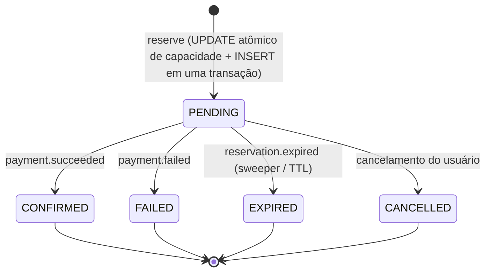

# PulsarPass — Blueprint de Arquitetura

Sistema de reserva de ingressos para eventos de alta demanda (*flash sales*), com altíssima concorrência, consistência eventual, tolerância a falhas e baixa latência.

## 1. Visão Geral

O PulsarPass resolve o problema de vender ingressos limitados quando milhares de usuários tentam comprar no mesmo segundo. O núcleo do domínio é a **reserva temporária com TTL**: o assento é bloqueado por uma janela (padrão: 10 min) enquanto o usuário conclui o pagamento. Se o pagamento não for confirmado a tempo — ou for recusado — o assento retorna ao estoque automaticamente.

### Garantias do sistema

| Garantia | Mecanismo |
|---|---|
| **Zero overbooking** | PostgreSQL é a fonte da verdade do inventário. Capacidade consumida por `UPDATE` atômico condicional (§8.1). Redis é apenas *fast-path* |
| **Nenhum evento perdido** | Transactional Outbox + relay (`pulsar-horizon`) com entrega *at-least-once* (§8.2) |
| **Processamento duplicado seguro** | Idempotência em 3 camadas: `Nats-Msg-Id` (dedup server-side do JetStream), tabela `processed_messages` por consumidor e `Idempotency-Key` HTTP no Gateway (§8.3) |
| **Sem assento vazado (leak)** | TTL via Redis como acelerador + *sweeper* periódico no PostgreSQL como rede de segurança (§8.4) |
| **Mensagem venenosa não trava o fluxo** | `max_deliver` + backoff + DLQ por consumidor (§8.5) |

## 2. Decisões Arquiteturais (ADRs resumidas)

| # | Decisão | Justificativa |
|---|---|---|
| ADR-1 | **PostgreSQL como fonte da verdade do inventário** — não Redis | Redis cluster é *eventually consistent*; failover pode perder locks e causar overbooking exatamente no pico. O `pulsar-core` só confirma a reserva quando o Postgres commita |
| ADR-2 | **Saga coreografada** com máquina de estados explícita no `pulsar-core` | Para o escopo atual, orquestrador dedicado é um serviço extra sem necessidade. A coreografia mantém baixo acoplamento; a máquina de estados centraliza as regras de transição |
| ADR-3 | **NATS JetStream** como único broker | Dedup server-side (`Nats-Msg-Id`), DLQ nativa (advisories), leve o suficiente para rodar embutido em testes. Decidir broker agora evita retrabalho |
| ADR-4 | **Pagamento iniciado pelo usuário dentro da janela TTL** | Fluxo realista de flash sale: reserva segura o assento; o usuário envia os dados de pagamento na janela |
| ADR-5 | **Database-per-service** (bases `pulsar_core` e `pulsar_payment`) | Nenhum serviço lê as tabelas do outro. Referências entre contextos são por ID, sem FK cruzada |
| ADR-6 | **Monorepo Go** com `cmd/` por serviço | Contratos de evento compartilhados compilados junto, CI único, refactors atômicos |
| ADR-7 | **Stdlib-first** no Ciclo 0 | O esqueleto usa apenas a biblioteca padrão (net/http com roteamento de métodos + path params, log/slog). Dependências entram quando a integração real exigir |
| ADR-8 | **OpenTelemetry SDK + exporter Prometheus** para observabilidade (Ciclo 3) | O §9 do blueprint nomeia OTel e Prometheus; o SDK dá uma API única para métricas (e traces no PR 2) com instrumentos no-op quando não inicializado (testes/tools pagam zero). `pkg/metrics` inicializa o provider global com exporter Prometheus próprio, exposto em `/metrics` no servidor de health; Jaeger/collector ficam para o tracing e o Ciclo 6 |
| ADR-9 | **Deploy alvo kind + Helm chart próprio + charts upstream single-node** (Ciclo 6) | kind reproduz a topologia do compose sem custo e roda no CI (job `deploy-smoke`); o chart `deployments/helm/pulsar-pass` empacota os 5 serviços com migrations como hooks, e a base usa charts upstream pinados (Prometheus 29.27.0, Grafana 10.5.15) + manifests fiéis ao compose (Postgres/Redis/NATS/Jaeger). Single-node por opção: réplicas dos serviços exercitam as garantias horizontais (queue groups, SKIP LOCKED); HA da base (CNPG, NATS 3×) fica para follow-up. Cloud real é overlay sobre os mesmos values |

## 3. Serviços

| Serviço | Responsabilidade | Comunicação |
|---|---|---|
| `pulsar-gateway` | Ingress HTTP: autenticação, rate limiting, validação e publicação de comandos. Idempotency-Key obrigatória nas mutações | HTTP → NATS (comandos) |
| `pulsar-core` | Dono do estoque e da reserva. Máquina de estados `PENDING → CONFIRMED / EXPIRED / FAILED / CANCELLED`. Capacidade consumida por update atômico no Postgres (autoridade); Redis registra `hold:{reservation_id}` como acelerador, com degradação graciosa | Consome comandos/eventos, publica eventos |
| `pulsar-chrono` | TTL worker: monitora `reservations.expires_at` (sweep no Postgres) e emite `reservation.expired` | Postgres → NATS |
| `pulsar-payment` | Processa o pagamento na janela TTL (acquirer simulado no MVP) e emite `payment.succeeded` / `payment.failed` | Consome comando, publica eventos |
| `pulsar-horizon` | Outbox relay: lê `outbox_events` das bases (core e payment) e publica no JetStream, garantindo entrega confiável | Postgres → NATS |

## 4. Topologia JetStream

| Stream | Subjects | Características |
|---|---|---|
| `RESERVATIONS` | `pulsarpass.reservations.commands.>` e `pulsarpass.reservations.events.>` | `Nats-Msg-Id` dedup window 2 min; retention `limits` |
| `PAYMENTS` | `pulsarpass.payments.commands.>` e `pulsarpass.payments.events.>` | idem |

Consumidores são **durables com queue group** (uma instância por grupo escala horizontalmente). Falhas seguem `ack_wait` + `max_deliver` com backoff; após esgotar, a mensagem vira advisory (DLQ) e é investigada — nunca descartada silenciosamente.

## 5. Fluxos

Fonte canônica dos diagramas: `docs/diagrams/`.

### 5.1 Caminho de sucesso

```mermaid
sequenceDiagram
    autonumber
    participant U as Usuário
    participant GW as pulsar-gateway
    participant N as NATS JetStream
    participant C as pulsar-core
    participant PG as PostgreSQL (core)
    participant R as Redis
    participant P as pulsar-payment

    U->>GW: POST /v1/reservations (Idempotency-Key)
    GW->>N: publish reservation.reserve (Nats-Msg-Id)
    N->>C: consome comando
    C->>PG: BEGIN; UPDATE events SET reserved_count = reserved_count + 1 WHERE id = $1 AND reserved_count + sold_count < capacity; INSERT reservation (PENDING, expires_at); INSERT outbox (ticket.reserved); COMMIT
    alt commit ok (assento garantido)
        C->>R: SET hold:{reservation_id} EX 600 (acelerador)
        C-->>GW: resposta (reservation_id, expires_at)
        GW-->>U: 201 Created
        U->>GW: POST /v1/reservations/{id}/payment (Idempotency-Key)
        GW->>N: publish payment.process
        N->>P: consome comando
        P->>P: acquirer.charge() (simulado)
        P->>N: publish payment.succeeded (Nats-Msg-Id)
        N->>C: consome evento
        C->>PG: BEGIN; reservation → CONFIRMED; reserved_count-1; sold_count+1; tickets → SOLD; outbox (ticket.confirmed); COMMIT
        GW-->>U: ingresso confirmado
    else capacidade esgotada
        C-->>GW: rejeição imediata (sold out)
        GW-->>U: 409 Conflict
    end
```

### 5.2 Caminho de compensação (timeout)

```mermaid
sequenceDiagram
    autonumber
    participant CH as pulsar-chrono
    participant PG as PostgreSQL (core)
    participant N as NATS JetStream
    participant C as pulsar-core
    participant R as Redis
    participant U as Usuário

    Note over CH,PG: rede de segurança — sweeper periódico (independe de Redis)
    CH->>PG: SELECT ... FROM reservations WHERE status = 'PENDING' AND expires_at < now() FOR UPDATE SKIP LOCKED LIMIT $1
    CH->>N: publish reservation.expired (Nats-Msg-Id)
    CH->>R: DEL hold:{reservation_id} (higiene)
    N->>C: consome evento
    C->>PG: BEGIN; reservation → EXPIRED; reserved_count-1; tickets → AVAILABLE; outbox (ticket.released); COMMIT
    Note over C,PG: mesma transação garante consistência estado + evento
    N->>CH: ack
    U-->>U: recebe 409/410 ao tentar pagar após expiração
```

O mesmo caminho de compensação é acionado por `payment.failed` (recusa) e `reservation.cancelled` (desistência), consumidos pelo `pulsar-core`.

## 6. Máquina de Estados da Reserva



Transições são validadas **no domínio** (`internal/core/domain`): qualquer transição inválida retorna erro e é inofensiva em reentregas (*at-least-once*).

## 7. Padrões de Resiliência e Consistência

### 7.1 Zero overbooking — Postgres como autoridade

```sql
UPDATE events
   SET reserved_count = reserved_count + $2,
       updated_at     = now()
 WHERE id = $1
   AND reserved_count + sold_count + $2 <= capacity;
-- 0 linhas afetadas => esgotado: rejeição imediata
```

Se o `UPDATE` afetar 0 linhas, o comando é rejeitado na hora. A contagem agregada (`reserved_count`/`sold_count`) evita consultas de disponibilidade concorrentes e é protegida por constraint de integridade (`reserved_count + sold_count <= capacity`).

### 7.2 Transactional Outbox

Eventos são inseridos na `outbox_events` **na mesma transação** da mudança de estado. O `pulsar-horizon` faz polling com `FOR UPDATE SKIP LOCKED`, publica no JetStream usando o `id` do evento como `Nats-Msg-Id` e marca `processed_at`. Crash entre publicar e marcar é absorvido pelo dedup do JetStream.

### 7.3 Idempotência — 3 camadas

1. **Publicação**: `Nats-Msg-Id = event_id` → JetStream descarta duplicatas dentro da janela de dedup.
2. **Consumo**: cada consumidor grava `message_id` em `processed_messages` (transação única com o efeito da mensagem); reentrega é ignorada.
3. **Entrada HTTP**: `Idempotency-Key` obrigatória em mutações do Gateway; reservas duplicadas do mesmo usuário (mesmo evento, status ativo) são bloqueadas por índice único parcial.

### 7.4 TTL e reconciliação

Redis mantém `hold:{reservation_id}` com `EX` = TTL restante como acelerador: escrito pelo `pulsar-core` após o commit da reserva e removido na confirmação/liberação (falha do Redis vira log de warning — `internal/holds`). A **fonte da verdade do vencimento** é `reservations.expires_at` no Postgres: o `pulsar-chrono` executa sweep periódico com `FOR UPDATE SKIP LOCKED`, emite `reservation.expired` e faz a higiene do hold (`DEL`). Mesmo que o Redis perca dados (failover, restart), nada vaza.

### 7.5 Entrega e falhas

- *At-least-once* em todos os consumidores; consumidores são idempotentes por construção.
- `ack_wait` (ex.: 30s) + `max_deliver` (ex.: 5) com backoff exponencial.
- Esgotadas as tentativas: advisory de DLQ + alarme; consumidor segue adiante.

## 8. Contrato de Eventos

Envelope único para todo evento/comando (versionado por campo, não por quebra de schema):

```json
{
  "event_id": "UUID v4 — também usado como Nats-Msg-Id",
  "event_type": "ticket.reserved",
  "event_version": 1,
  "source": "pulsar-core",
  "correlation_id": "id da transação de negócio raiz",
  "causation_id": "event_id da mensagem que causou esta",
  "occurred_at": "RFC 3339"
}
```

Constantes de tipo/subject vivem em `pkg/envelope` (fonte única de contratos no monorepo).

### Catálogo (v1)

| event_type | Producer | Consumers | Efeito |
|---|---|---|---|
| `reservation.reserve` (comando) | gateway | core | Cria reserva PENDING + outbox |
| `ticket.reserved` | core | payment | Inicia janela de pagamento |
| `payment.process` (comando) | gateway | payment | Executa charge |
| `payment.succeeded` | payment | core | PENDING → CONFIRMED |
| `payment.failed` | payment | core | PENDING → FAILED + libera assento |
| `reservation.expired` | chrono | core | PENDING → EXPIRED + libera assento |
| `ticket.confirmed` | core | (notificação) | Emissão do ingresso |
| `ticket.released` | core | (notificação) | Assento de volta ao estoque |

## 9. Observabilidade

- **Métricas**: OTel SDK + exporter Prometheus (ADR-8) em `/metrics` na porta de health de cada serviço (9091–95), instrumentos no-op até o bootstrap. Sinais: `pulsar_gateway_http_requests_total`/`..._request_duration_seconds` (p99), `pulsar_core_reservations_total` (com `outcome="sold_out"`), `pulsar_payment_charges_total`, `pulsar_horizon_outbox_backlog`, `pulsar_chrono_pending_max_age_seconds`, `pulsar_eventbus_dlq_advisories_total`, `pulsar_holds_*` (ops, latência, estado do breaker).
- **Tracing**: OTel OTLP (Jaeger no compose, UI `:16686`) com `traceparent` propagado nos headers do broker — gateway abre a raiz e cada handler consome dentro do mesmo trace; `correlation_id` é atributo de span. Gateway não extrai contexto de upstream por decisão (raiz do trace).
- **Dashboards**: Prometheus + Grafana provisionados no compose **e no cluster kind** (ConfigMap gerado do mesmo JSON, sidecar do chart); dashboard "PulsarPass — Saga overview" cobre os cinco sinais do blueprint e o alarme de acelerador degradado. No cluster, o Prometheus raspa **por pod** (`dns_sd_configs` contra services headless do chart) — raspando via Service, o LB entre réplicas derruba séries por processo.
- **Logs**: `log/slog` estruturado; `production` em JSON.

## 10. Layout do Repositório

```
pulsar-pass/
├── cmd/                    # um binário por serviço
│   ├── pulsar-gateway/
│   ├── pulsar-core/
│   ├── pulsar-chrono/
│   ├── pulsar-payment/
│   └── pulsar-horizon/
├── internal/               # código privado por serviço (Clean Architecture)
│   ├── gateway/
│   ├── core/
│   │   ├── domain/         # entidades + máquina de estados (sem I/O)
│   │   └── application/    # portas (interfaces) + orquestração
│   ├── chrono/
│   ├── payment/
│   └── horizon/
├── pkg/                    # bibliotecas compartilhadas (estáveis)
│   ├── config/
│   ├── logger/
│   ├── health/
│   ├── uid/
│   ├── envelope/           # contratos de eventos
│   └── eventbus/           # abstração do broker
├── migrations/             # SQL versionado por serviço
│   ├── core/
│   └── payment/
├── deployments/            # compose, Dockerfile, kind, cluster e chart
│   ├── docker/             # Dockerfile + provisioning do compose
│   ├── docker-compose.yml  # infra local
│   ├── k6/                 # suíte de carga
│   ├── kind/               # config do cluster de deploy (Ciclo 6)
│   ├── cluster/            # manifests de infra + smoke do cluster
│   └── helm/pulsar-pass/   # chart dos 5 serviços (migrations via hooks)
├── docs/                   # este blueprint + diagramas
└── scripts/
```

Regras: `internal/<svc>/domain` não importa nada de I/O; adapters (Postgres, NATS, Redis) implementam as portas de `application`; `pkg/` não conhece o domínio.

## 11. Configuração (variáveis de ambiente)

| Variável | Serviço | Padrão | Descrição |
|---|---|---|---|
| `APP_ENV` | todos | `development` | `development` / `production` |
| `HEALTH_ADDR` | todos | `:9091`–`:9095` | Porta liveness/readiness |
| `HTTP_ADDR` | gateway | `:8080` | Porta da API |
| `NATS_URL` | gateway, core, chrono, payment, horizon | `nats://localhost:4222` | Broker |
| `REDIS_ADDR` | core, chrono | `localhost:6379` | Fast-path de hold (`hold:{reservation_id}`); degradação graciosa |
| `DATABASE_URL` | core / payment | DBs `pulsar_core` / `pulsar_payment` | Postgres do serviço |
| `RESERVATION_TTL` | core | `10m` | Janela de retenção |
| `SWEEP_INTERVAL` / `SWEEP_BATCH` | chrono | `5s` / `100` | Sweeper de expiração |
| `POLL_INTERVAL` / `RELAY_BATCH` | horizon | `1s` / `200` | Relay do outbox |
| `MAX_RESERVATION_QTY` | gateway | `8` | Limite anti-hoarder |

## 12. Roadmap de Ciclos

| Ciclo | Escopo | Status |
|---|---|---|
| 0 | Fundação: blueprint, esqueleto dos 5 serviços, migrations, infra local | ✅ |
| 1 | Adaptadores reais: Postgres (capacidade atômica, outbox, dedup) + NATS JetStream (streams, consumers durables, DLQ) | ✅ |
| 2 | Saga ponta a ponta (sucesso + compensações) com testes de integração (testcontainers) + acelerador Redis | ✅ |
| 2½ | Hardening pós-Ciclo 2: posse da reserva no payment (`ErrNotOwner`), `-race` no `make test`, circuit breaker do acelerador Redis | ✅ |
| 3 | Observabilidade: OTel + métricas + dashboards | ✅ |
| 4 | Prova de carga (k6): validar p99 e zero overbooking sob pico | ✅ |
| 5 | CI + release pipeline (GitHub Actions, GoReleaser, GHCR multi-arch) | ✅ |
| 6 | Deploy (cluster + observabilidade) e hardening | ✅ |
